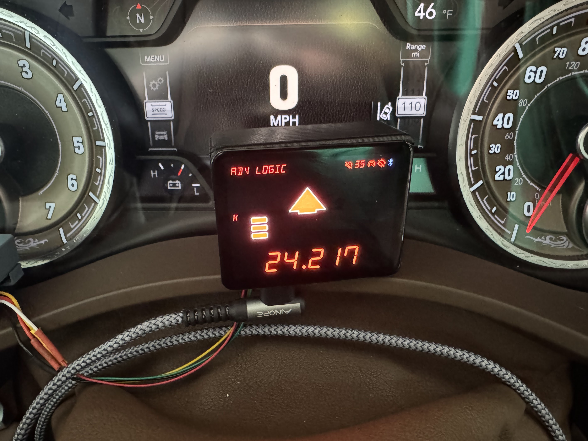

# ESP32 Remote Display for Valentine One (Gen 2)

This is a remote display for the Valentine One Gen 2 radar detector written in C++, inspired by SquirrelMaster on [rdforum](http://rdforum.org)

Connectivity is via Bluetooth Low Energy (BLE) and currently has only been tested as a solo accessory. If you want to use this along
with another accessory or app such as JBV1, you will need a [V1Connection LE](https://store.valentine1.com/store/item.asp?i=20232). Again
this is untested and is something I'll be considering in a future release. A quick run-down of the radar-related features:
- Directional arrows (front/side/rear)
- Band display (in GHz)
- Signal strength per alert
- Alert table support (up to 4 alerts)
- Priority alert band and direction will blink when multiple alerts are present
- GPS support (including SilentRide and location-based lockout)
- Wireless charging
- Battery-powered
- OTA updates

The hardware is a [LilyGO T4 S3](https://lilygo.cc/products/t4-s3). It is an ESP32 microcontroller with WiFi, Bluetooth Low-Energy (BLE), 
and a 2.9" AMOLED display. A previous version of this project can be found in my repo for the T-Display S3.

Here's what's done in the current release:
- BLE auto-scan for connecting to a V1 Gen2 advertising the appropriate characteristics / service
- WiFi enabled (by default as an AP for user configuration), defaults as follows:
    - SSID: v1display
    - Password: password123
    - IP: 192.168.242.1
- Web-based UI for configuration and device details
- Landscape mode (Portrait support TBD)
- "Store mode" for display testing

Here's the TODO as of Feb 2025: (in descending order of priority)
- Touch-screen interaction for user-defined lockouts
- Timezone support for auto-brightness (sunrise/sunset)

If you have suggestions or requests, please ping me on the [rdforum valentine one](https://www.rdforum.org/threads/136559/) sub on rdforum.

# How you can support this project

A few months ago, my six-year-old son was diagnosed with a very rare form of cancer called Chordoma. After a complete resection of the tumor in November 2024, we've had several months of healing, throughout which I've poured my free time into this project. We have a long road of daily radiation ahead, but this is something I can continue to fill my hours with while also serving the countermeasure community.

Donate here: [Chordoma Foundation](https://www.chordomafoundation.org/?campaign=462024) - if you can check "in honor of":
Name: D Garreau
Email: dggameon@proton.me

# Installing to your T4 S3

1. Clone this repo
2. Load the project in VSCode (or your IDE of choice)
3. In PlatformIO - go to Project Tasks - v1server - Platform - Upload Filesystem Image
3. Compile and push to your board
4. Turn on your V1, then connect to a wireless charger or USB-C

OR

1. In releases, download the firmware binaries
2. Load spiffs.bin as your filesystem image
3. Load firmware.bin as the board firmware

# Picking a case

Hopefully you have a 3d printer, or access to one! This will be updated once I've finished some designs that accommodate the hardware components.

# Sample images

No alerts:

Settings screen:

Single alert:

Multi-alert:

Web UI:

# Debugging

In the event you'd like to debug or troubleshoot, your best bet is to open VScode, open the serial monitor and then connect your ESP32 device directly
to your laptop. The device will function as normal, but you'll have the added benefit of being able to see the debug functionality printed to your
console. That'll include some detailed information on the size of the alert table, the index of the alert triggered, the type of alert, band value,
direction, signal strength (front and rear), priority and junk alert status. There are LOTS of debug points available in the code if you look for them.

You can enable CPU/FPS visibility in lv_conf.h:
`#define LV_USE_PERF_MONITOR 1`

You can also enable debug mode in platformio.ini:
`build_type = debug` 
`monitor_filters = esp32_exception_decoder`